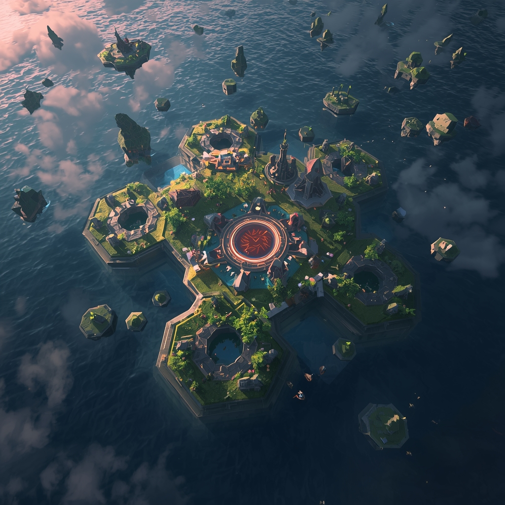

# Kingdom of Hex

<p align="center">
  
</p>

<p align="center">
  <strong>A strategy roguelike about raising a medieval kingdom on a living hex map.</strong>
</p>

<p align="center">
  Build your economy. Research new tools. Survive raids. Push for 1000 gold before the realm collapses.
</p>

<p align="center">
  
  
  
  
</p>

---

## The Pitch

`Kingdom of Hex` starts as a handcrafted kingdom-builder and then turns the screws.

- Every run begins on a procedural hex world generated with Wave Function Collapse.
- You place production buildings, train units, and shape a defensive frontier.
- Goblin pressure ramps over time through wave logic, intent systems, and escalation rules.
- Meta-progression lets strong runs feed the next campaign.

This repo has the feel of an active game project rather than a rendering demo: game systems, UI modules, analytics hooks, automated tests, balancing rules, itch.io media, and launch docs all live here.

## Game Loop

1. Expand onto the map and lock down your economy.
2. Convert wood, food, stone, science, and gold into momentum.
3. Research better tools, buildings, and long-run advantages.
4. Deploy units and react to enemy intent before waves land.
5. Hit the win condition before the board state gets away from you.

## Highlights

- **Procedural kingdom maps** backed by WFC-based terrain generation and hex-grid utilities.
- **Turn-based strategy systems** for combat, enemy AI, resources, research, progression, and saves.
- **Readable tactical UI** with HUD modules, minimap, kill feed, modal screens, and tutorial surfaces.
- **Modern project structure** split across `src/core`, `src/game`, `src/gameplay`, `src/ui`, and `src/app`.
- **Real test coverage** with Vitest unit/integration tests and Playwright end-to-end checks.

## Tech Stack

| Layer | Tools |
| --- | --- |
| Rendering | Three.js, WebGPU, GSAP |
| App tooling | Vite, TypeScript config, modern ES modules |
| Game logic | Custom systems in `src/game` and `src/gameplay` |
| Testing | Vitest, Playwright |
| Data / validation | Zod |

## Quick Start

```bash
npm install
npm run dev
```

Use a WebGPU-capable browser for the full visual pipeline.

## Development Commands

```bash
npm run dev
npm run build
npm test
npm run test:watch
npm run test:e2e
npm run test:e2e:ui
npm run benchmark
npm run itch-media
```

## Project Map

| Path | Purpose |
| --- | --- |
| `src/App.js` | Main app shell, renderer boot, orchestration |
| `src/app/` | Launch flow, menus, overlays, tutorial/pause surfaces |
| `src/core/` | Input, audio, analytics, errors, events, performance helpers |
| `src/game/` | Combat, sessions, units, saves, progression, run content |
| `src/gameplay/` | Placement rules, biome modifiers, waves, world events |
| `src/ui/` | HUD, screens, shared UI tokens |
| `src/hexmap/` | Terrain generation, map visuals, interaction, effects |
| `tests/` | Unit, integration, benchmark, and e2e coverage |

## Current Feel

The project is in a strong prototype-to-production transition zone:

- the rendering stack already sells a distinct identity
- the strategy layer has real pressure and pacing
- the repo now reflects a full game pipeline, not just a visual experiment

## Credits

- [felixturner/hex-map-wfc](https://github.com/felixturner/hex-map-wfc) for the original map tech foundation
- [KayKit Medieval Hexagon Pack](https://kaylousberg.itch.io/kaykit-medieval-hexagon) for tile assets
- [Maxim Gumin's Wave Function Collapse](https://github.com/mxgmn/WaveFunctionCollapse) for the core procedural inspiration

## License

Code in this repository is released under [MIT](LICENSE).

Bundled art, audio, models, and promo media may carry separate usage terms. See [ASSET_POLICY.md](ASSET_POLICY.md).
